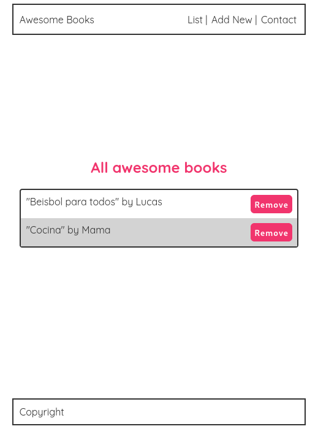

Awesome Books to course

# Awesome Books Modules

> Awesome books using HTML, CSS, and JavaScripts

## Built With

- HTML, CSS and JavaScripts

## Getting Started

To get a local copy up follow these simple example steps.

### Prerequisites

- GIT

### Setup

Open a terminal or a git bash in the desired directory and run `https://github.com/hendridg/awesome-books.git`

👤 **Author1**

- GitHub: [@hendridg](https://github.com/hendridg)
- Twitter: [@hendridg](https://twitter.com/hendridg)
- LinkedIn: [LinkedIn](https://linkedin.com/in/hendridg)

👤 **Author2**

- GitHub: [@andres-condezo](https://github.com/andres-condezo)
- Twitter: [@andres_condezo](https://twitter.com/andres_condezo)
- LinkedIn: [andres-condezo](https://linkedin.com/in/andres-condezo)

👤 **Author3**

- GitHub: [@lisandroseia](https://github.com/lisandroseia)
- LinkedIn: [LinkedIn](https://www.linkedin.com/in/lisandro-seia-295120225/)

## 📝 License

This project is [MIT](./MIT.md) licensed.
